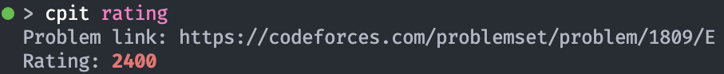

# CPIT (Competitive Programming Interface Tool)

### Table of Contents 
- [Background](#Background)  
- [Summary](#Summary-of-CPIT)  
- [How to use](#Summary-of-CPIT)
- [Checker](#Checker)
    - [Checker Usage](#Checker-Usage)
- [Parser](#Parser)
    - [Parser Usage](#Parser-Usage)
- [Rating](#Rating)
    - [Rating Usage](#Rating-Usage)
- [Memory](#Memory)
    - [Memory Usage](#Memory-Usage)
- [Future Steps](#Future-Steps)
## Background

I've been doing competitive programming for a few years now, and during that time, I've created a decent amount of command line tools to streamline certain processes in the terminal and make life easier. This repository is a collection of the tools that I've created, which I hope can help out others! I'd be happy to take any feedback or questions!

## Summary of CPIT
This is a command line tool for competitive programming (mainly tested with the Codeforces platform, and for users who use C++). The main tools provided by this is the ability to automatically test your code against sample cases and parse sample cases from the Codeforces website to your local directory. A couple other smaller tools is the ability to get the rating for a problem, and estimate how much memory an array of certain length will take. 

## How to use it

This tool is ran with `python3`. Make sure to install the required libraries to run it.

```
pip install -r requirements.txt
```

To make this tool easier to use, I set up an alias. This can be put in `/.bashrc` to save the alias (or whatever equivalent file for your environment).
Alias:
```
alias cpit='python3 [PATH_OF_REPO]/cpit.py' 
```

Below are the details to run specific commands. All commands should be ran in the terminal.

### Checker
**Automatically test your code against samples**

One of the cool features about this tool is the ability to test your code on sample test cases. Specifically, this tool will automatically check all files with `.in` and `.out` extensions in the directory you are currently in, then run those samples against your code, and print out any differences between your code's output and the expected sample output.

#### Checker: Usage
To run this tool:

```
cpit checker [EXECUTABLE_NAME]
```
(Note: this command requires that the program is already compiled, then the name or path to the executable is passed as an argument to be ran)


### Parser
**Parse sample input/output files on Codeforces**

To pair with this feature, I also created another feature to parse the sample input/outputs on a Codeforces webpage, then download them locally into `.in` and `.out` files that can then be used with the previous `checker` command. On top of an individual problem, this feature can also parse all the problems of a contest, creating a subdirectory for each problem, with the corresponding sample input/outputs in that subdirectory. 

#### Parser: Usage
To parse a single problem:

```
cpit parse ['1' or 'o' or 'p'] [PROBLEM_LINK]
```


To parse a contest:

```
cpit parse c [CONTEST_ID]
```

(Note: The contest ID can be found in the URL of the contest page. For example, the contest ID of https://codeforces.com/contest/1993 is 1993)


### Rating
**Get the rating of Codeforces problems**

Another small tool is the ability to get the rating of a Codeforces problem in the terminal. Personally, I disable tags in Codeforces problems, which also includes the rating tag. This feature allows me to continue to disable tags, but be able to get the rating if I want to see it.

#### Rating: Usage

To run this command:

```
cpit rating
```

You will then be prompted to enter a Codeforces problem link, which you can paste in to get the rating. 



### Memory
**Estimate memory an array will take**

Finally, the last small feature is a tool to help quiclkly estimate how much memory an array will take, which can be important to determine whether a solution will fall in the proper memory limits. 

#### Memory: Usage
To run the command:

```
cpit mem
```

You will first be prompted with the length of the array, which can be entered as an integer, like `5000`, or in scientific notation, like `4.5e5`. 

Then, you will be promted with the data type of the array. Currently, it only supports `int`, `ll`, and `double`.


## Future Steps

I hope to continue improving CPIT and provide more features/tools to enhance convenience in competitive programming. Some future steps I have in mind are:

* Add support for other platforms for parsing, such as AtCoder
* Fix bugs where parser doesn't work if Cloudflare is in use
* Potentially more features!
